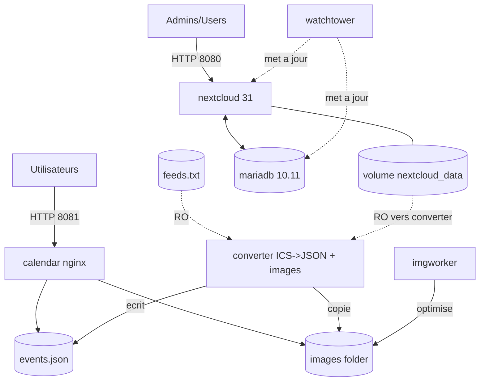

# Le calendrier centralisé des Associations Universitaires

Solution de déploiement pour gérer des calendriers partagés entre plusieurs associations universitaires et diffuser les événements publiquement tout au même endroit.

## Résumé de notre solution

- Le problème qui était à résoudre : plusieurs associations universitaires publieent leurs événements sur des calendriers séparés (Google Calendar, iCal, etc.) et il est difficile pour les étudiants de les retrouver.

- Notre solution : un stack Docker qui agrège ces calendriers dans une interface web unique et publique, avec une gestion simple des utilisateurs et des droits d'accès.

### réeutilisation des projets open-source
Nous avons réutilisé plusieurs projets open-source pour construire notre solution afin de maximiser la robustesse et minimiser le temps de développement :

- [Nextcloud](https://nextcloud.com/) pour la gestion des utilisateurs et l'interface d'administration
- [FullCalendar](https://fullcalendar.io/) pour l'affichage des calendriers
- plusieurs autres packages python pour la conversion des formats de calendrier (ICS vers JSON)

## Prérequis

**Docker** (>=20.10) et **Docker Compose** installés

---

## Comment le stack fonctionne





## Comment déployer le stack

1. Cloner ce dépôt Git :

```bash

git clone https\://github.com/votre-utilisateur/votre-repo.git

cd dockerStackCalendrier

```

2. Créer et éditer le fichier `.env` en vous basant sur `.env.example` :

```bash

cp .env.example .env

# Éditez `.env` avec vos valeurs (ex. `NEXTCLOUD_HOST`, `DB_PASSWORD`, etc.)

nano .env

```

3. créer réseaux docker web

```bash
docker network create web || true

```

4. Partir le stack avec Docker Compose 

```bash

docker-compose up -d --build

```

4. Accéder à l'interface web de Nextcloud pour finaliser l'installation.

example: 
port 8080 --> http://localhost:8080 (nextcloud)
port 8081 --> http://localhost:8081 (Calendrier des Assos)

---


