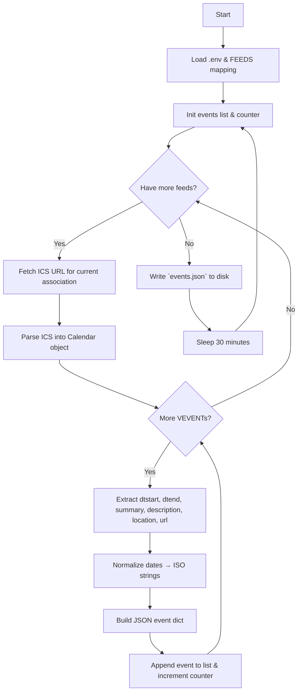

# Installation du serveur docker

## Prérequis

* **Docker** (>=20.10) et **Docker Compose** installés sur votre machine.
* Un **Cloudflare Tunnel** configuré (ID du tunnel + fichier de crédentiels JSON + token).
* Un enregistrement DNS CNAME ou A pointant votre sous-domaine (ex. `calendar.school.edu`) vers le Tunnel Cloudflare.
* Un réseau Docker nommé `calnet` (ou tout autre nom de votre choix).
* Tous les fichiers en place :
* `docker-compose.yml` (services principaux)
* `.env` configuré
* `cloudflared/config.yml` et `cloudflared/cred-<tunnel-id>.json`
* `themes/my-school/`
* `scripts/initialize.sh`

---

## workflow du script de convertions ics vers json




---


## 1. importer les secrets dans `.env`

```bash
cp .env.secret .env
```

## 2. Rendre le script d’initialisation exécutable

```bash
chmod +x scripts/initialize.sh
```

## 3. Lancer le stack

```bash
# démarre la base de données, Nextcloud et le Tunnel Cloudflare
docker-compose up -d
```

## 4. Finaliser l’installation via l’interface Web

1. Ouvrez votre navigateur sur **https\://`${NEXTCLOUD_HOST}`**.
2. Créez l’utilisateur **admin** et son mot de passe.
3. Les informations de la base de données sont pré-remplies depuis `.env`.
4. Terminez l’assistant d’installation.

> Dès le démarrage, `scripts/initialize.sh` s’exécute automatiquement pour :
>
> * activer uniquement l’application **Calendrier**,
> * désactiver les apps inutiles,
> * créer le groupe `calendar-creators` et ses utilisateurs,
> * partager le calendrier en lecture publique et avec droits d’édition pour le groupe.

## 5. Configurer le tunnel Cloudflare (ou le port forwarding au choix)

pour tester l'application on la host sur un serveur proxmox avec un tunnel Cloudflare. 

## 6. Étapes post-installation

```bash
# réparer la configuration et vider le cache
docker-compose exec nextcloud occ maintenance:repair
# optionnel : nettoyer le cache des fichiers
docker-compose exec nextcloud occ files:cleanup
```

## steps d'installation docker-compose

```bash
# créer le réseau Docker si nécessaire
docker network create web || true

# lancer le stack

docker-compose up -d

# vérifier que tout est en ordre
docker-compose ps

# vérifier les logs

docker-compose logs -f

# pour arrêter le stack
docker-compose down
```
