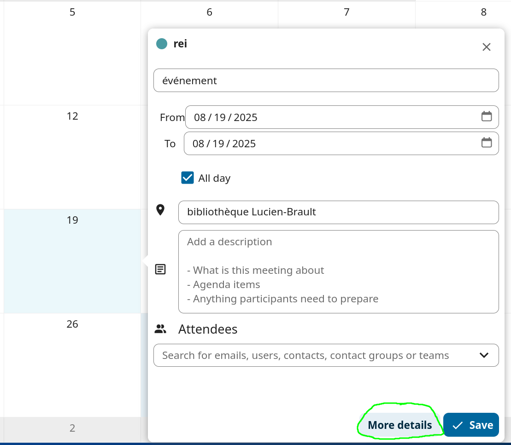
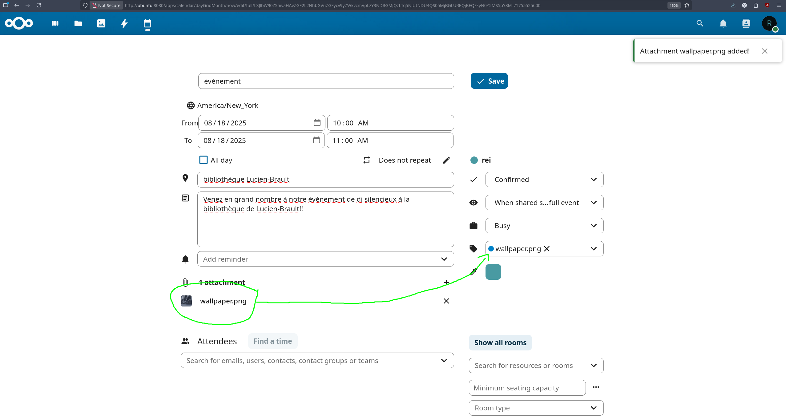
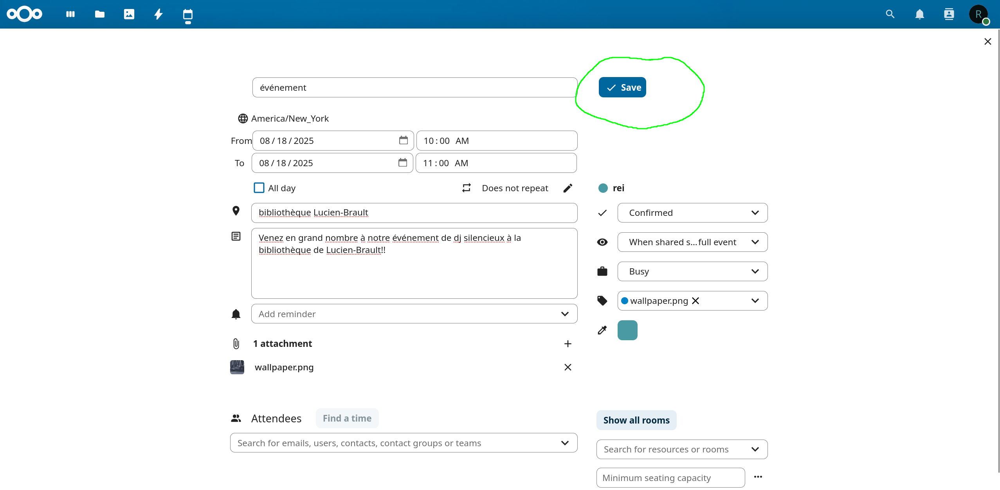
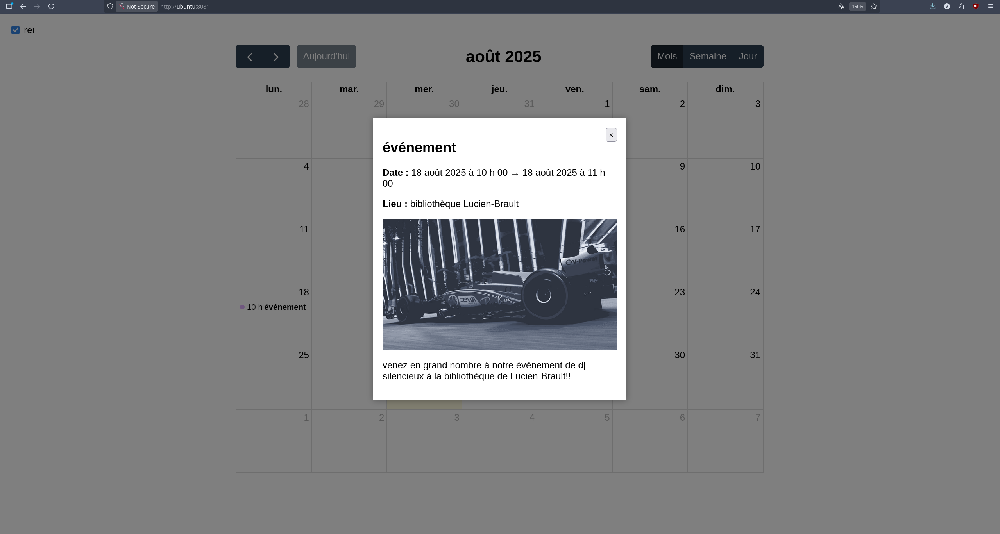

# Le calendrier centralisé des Associations Universitaires

Solution de déploiement pour gérer des calendriers partagés entre plusieurs associations universitaires et diffuser les événements publiquement tout au même endroit.

## Résumé de notre solution

- Le problème qui était à résoudre : plusieurs associations universitaires publieent leurs événements sur des calendriers séparés (Google Calendar, iCal, etc.) et il est difficile pour les étudiants de les retrouver.

- Notre solution : un stack Docker qui agrège ces calendriers dans une interface web unique et publique, avec une gestion simple des utilisateurs et des droits d'accès.

### réeutilisation des projets open-source
Nous avons réutilisé plusieurs projets open-source pour construire notre solution afin de maximiser la robustesse et minimiser le temps de développement :

- [Nextcloud](https://nextcloud.com/) pour la création des évênements par les associations
- [FullCalendar](https://fullcalendar.io/) pour l'affichage du calendrier sur le site public
- plusieurs autres packages python pour la conversion des formats de calendrier (ICS vers JSON)

## Prérequis

**Docker** (>=20.10) et **Docker Compose** installés

---

## Architecture du système


## Comment déployer le stack

1. Cloner ce dépôt Git :

```bash

git clone https://github.com/hamoncode/dockerStackCalendrier.git

cd dockerStackCalendrier

```

2. Créer et éditer le fichier `.env` en vous basant sur `.env.example` :

```bash

cp .env.example .env

nano .env

# Éditez `.env` avec vos valeurs (ex. `NEXTCLOUD_HOST`, `DB_PASSWORD`, etc.)
# Il est important que vous preniez note du nom d'usager et du mot de 
#   passe administrateur NextCloud, car vous en aurez besoin à la prochaine étape

```

3. créer réseaux docker web

```bash
docker network create web || true

```

4. Partir le stack avec Docker Compose 

```bash

docker-compose up -d --build

```

5. Ouvrez l'interface NextCloud sur votre navigateur web en entrant l'adresse suivante : `http://localhost:8080/`

6. Enregistrez-vous en tant qu'administrateur avec les identifiants de l'étape 2
7. Cliquez sur l'icône de votre compte administrateur, puis sur "ajouter des applications"
8. Installez l'application "Agenda"
9. Visitez le calendrier des élèves avec l'URL suivante : `http://localhost:8081/`
---

## comment ajouter un association en tant qu'utilisateur nextcloud

1. lancer script d'automatisation nc_add_calendar_user.sh

```bash
./nc_add_calendar_user.sh

```
  - répondre aux questions posées dans le cli

2. se connecter avec le compte et aller chercher le ics plublic de l'utilisateur dans nextcloud(voir screenshots comment aller chercher dans GUI)


3. ajouter le lien ics dans le fichier feeds.txt

```bash
nano ./converter/feeds.txt
```
- declarer le nom de votre asso = ajouter le lien ics copié dans nextcloud 
changer le domaine pour le volume partagé docker (nextcloud dans notre cas)

exemple: 

rei=https://**ubuntu:8080**/remote.php/dav/calendars/asso/calendarname/calendar.ics

devient 

rei=http://**nextcloud**/remote.php/dav/calendars/asso/calendarname/calendar.ics

4. relancer le container converter pour prendre en compte le nouveau feed

```bash
docker-compose restart converter
```

5. demander a l'association de changer son mot de passe temporaire nextcloud pour un mot de passe robuste 

## Comment l'association ajoute un événement **et y attacher une image (ou un gif!)**

1. L'association se connecte à Nextcloud avec son compte utilisateur

2. Aller dans l'application "Calendrier" (Calendar)

3. Créer un nouvel événement en cliquant sur le bouton "+" (Ajouter)

4. Remplir les détails de l'événement (titre, date, description, etc.)

5.**pour ajouter une image** : 
    




**Très important** : on doit peser sur entrer après avoir entrer le nom de l'image dans les tags pour que l'image soit bien prise en compte

6. **sauvegarder** l'événement




7. Attendre que le script de conversion (converter) s'exécute (toutes les 1 minute)

8. Vérifier que l'événement apparaît sur le calendrier public (port 8081)


